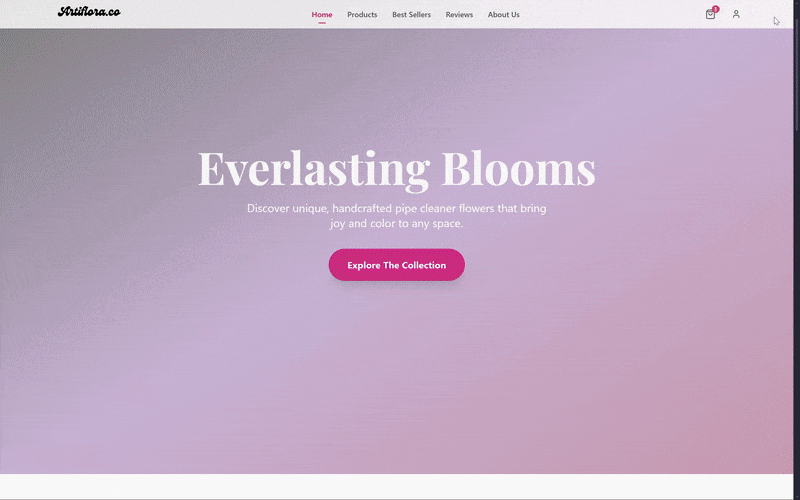
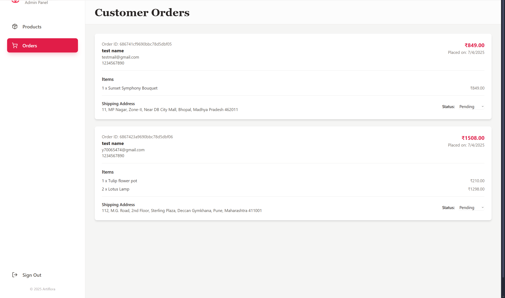
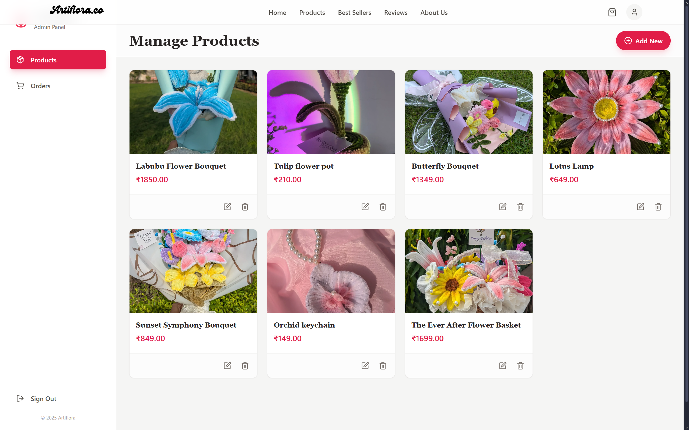
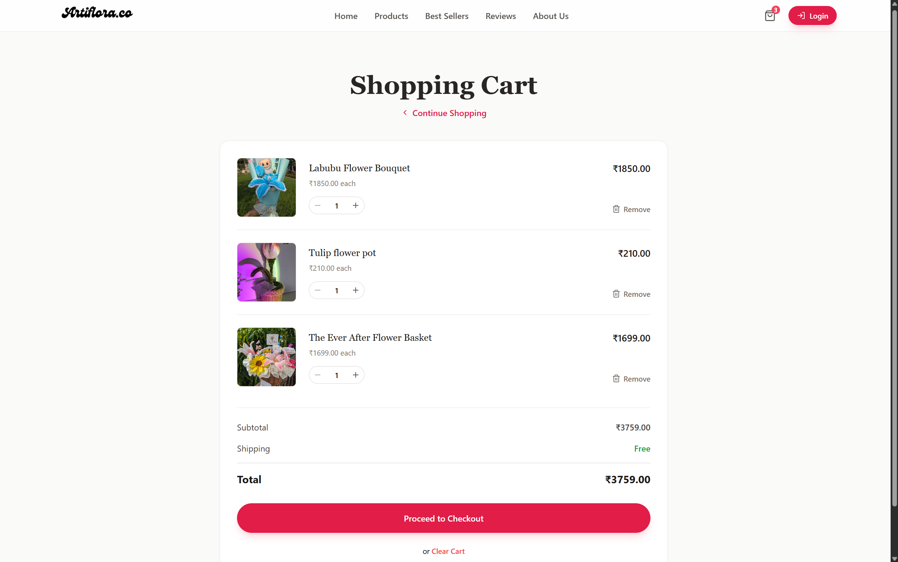
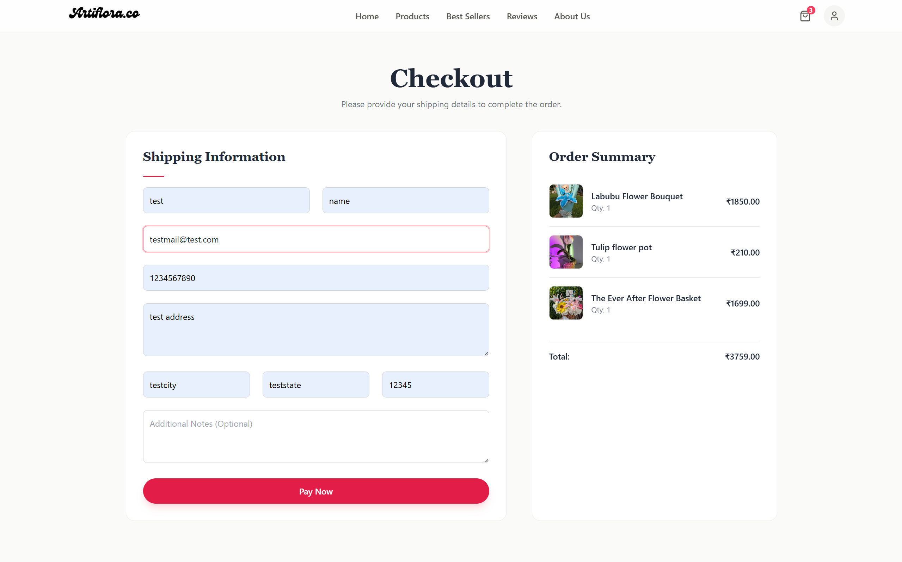
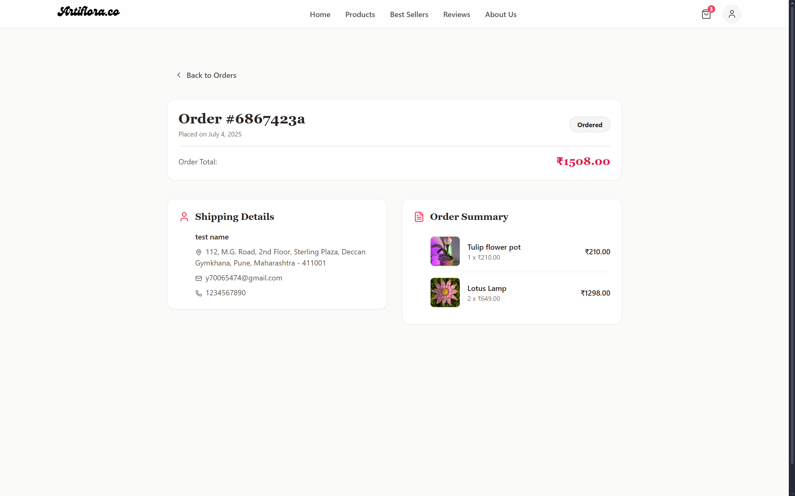

# 🌸 Artiflora — Full Stack Responsive E-Commerce Web Application

        

---

## Overview

**Artiflora** is a modern, full-stack e-commerce web application designed for businesses to manage and sell products online. Featuring a secure login system, real-time cart, role-based access control (RBAC), admin dashboard, and seamless digital payment flow, it’s the complete commerce solution built for scale.

---

## 🌟Live Demo

Experience the app live here: [artiflora](https://artiflora-one.vercel.app)

---

## 📸 Demo Screens

- **🏠 Home Page**  
  Fully responsive storefront with featured products and categories  
  
  
- **🧑‍💼 Admin Panel**  
  Manage orders and products efficiently through the admin interface. 
  | Orders View | 	Products Management |
  |--------------|-------------|
  |  | |  
  
- **🛒 Cart + Checkout**  
  Seamless shopping cart experience and secure checkout process.
  | Cart Page | Checkout Page |
  |--------------|-------------|
  |  | |  
    

- **👤 User Dashboard**  
  View order history and manage product reviews or purchases.
  | Order Details | Product View |
  |--------------|-------------|
  |  | |  
  
---

## 🧠 Key Features

| Feature                 | Description                                                                 |
|-------------------------|-----------------------------------------------------------------------------|
| 🔐 Firebase Auth        | Secure user login and admin access via Firebase Authentication               |
| ⚙️ FastAPI Backend       | High-performance Python API with async routes and JWT-secured endpoints      |
| 🔐 RBAC                 | Role-Based Access Control with JWT + Firebase                               |
| 💳 RazorPay Payments       | Integrated RazorPay gateway for seamless and secure transactions           |
| 🛒 Persistent Cart      | Cart state stored via `localStorage` to persist across sessions              |
| 📱 Responsive Design    | Mobile-first design using Tailwind CSS and React                            |
| 📊 Admin Dashboard      | Manage products, orders, and categories with full CRUD support               |

---

## 🧾 Tech Stack

| Layer          | Technologies                                                           |
|----------------|------------------------------------------------------------------------|
| 🌐 Frontend    | React, Tailwind CSS                                      |
| ⚙️ Backend     | FastAPI (async), Pydantic, Uvicorn                                     |
| 🔐 Auth        | Firebase Auth, JWT, Role-Based Access                                  |
| 💳 Payments    | RazorPay Integration                                                      |
| 🛢️ Database    | MongoDB Atlas                                                          |
| ☁️ Deployment  | Vercel (frontend), Render (backend), Firebase Console          |
---
## Credits

Built with ❤️ by **PritkumarPagda**

---
